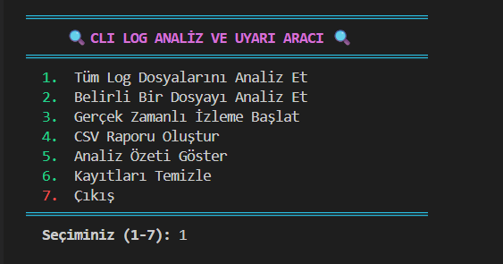
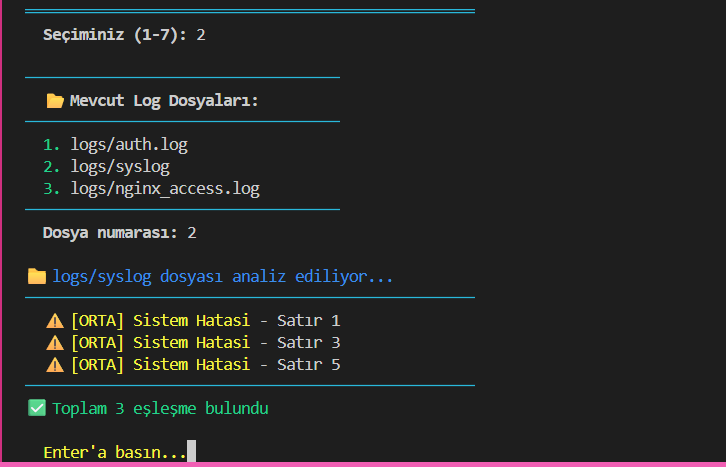

# 🔍 CLI Log Analiz ve Uyarı Aracı

Bu proje, Linux sistem loglarını analiz eden, kural tabanlı tespitler yapan ve sonuçları raporlayan **CLI tabanlı bir log analiz ve uyarı sistemidir**.


---

## Proje:

### Ana Menü
Program başlatıldığında karşılaşılan interaktif CLI menüsü:



---

### Log Analizi Sonuçları
Log dosyalarının kural tabanlı analiz edilmesi:



---

### CSV Rapor Çıktısı
Analiz edilen olayların CSV formatında raporlanması:


---

## 📌 Özellikler

- Dosya bazlı log analizi (auth.log, syslog, nginx_access.log)
- YAML tabanlı kural motoru
- Gerçek zamanlı log izleme 
- CSV formatında rapor üretimi
- Menü tabanlı kullanıcı arayüzü
- Docker desteği

---

## 📁 Proje Yapısı

CLI-LOG-ANALYZER/
├── logs/
│ ├── auth.log
│ ├── syslog
│ └── nginx_access.log
│
├── output/
│ └── report_*.csv
│
├── screenshots/
│ ├── menu.png
│ ├── analiz.png
│ └── rapor.png
│
├── app.py
├── Dockerfile
├── rules.yaml
└── README.md


---

##  Kurulum ve Çalıştırma

### Docker ile Çalıştırma 

```bash
docker build -t cli-log-analyzer .
docker run -it cli-log-analyzer

pip install pyyaml
python app.py
